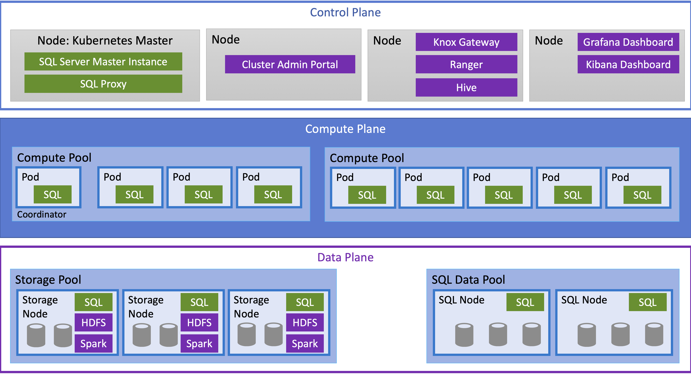
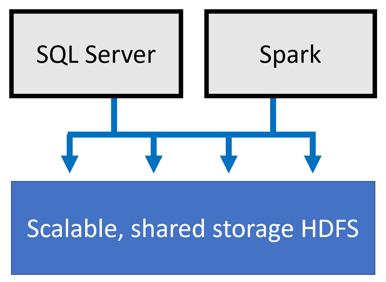
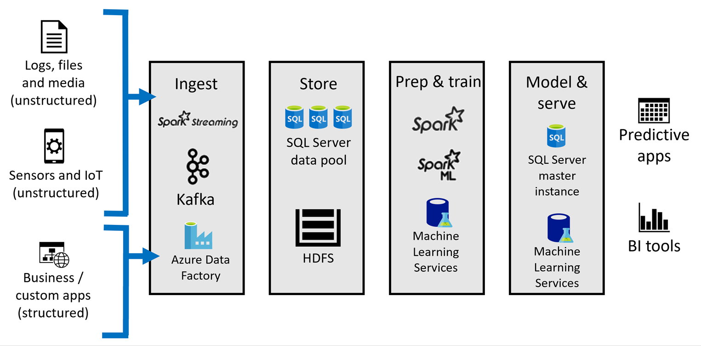

<div class="MCWHeader1">
Modernizing Data Analytics with SQL Server 2019
</div>

<div class="MCWHeader2">
Whiteboard design session trainer guide
</div>

<div class="MCWHeader3">
November 2019
</div>

Information in this document, including URL and other Internet Web site references, is subject to change without notice. Unless otherwise noted, the example companies, organizations, products, domain names, e-mail addresses, logos, people, places, and events depicted herein are fictitious, and no association with any real company, organization, product, domain name, e-mail address, logo, person, place or event is intended or should be inferred. Complying with all applicable copyright laws is the responsibility of the user. Without limiting the rights under copyright, no part of this document may be reproduced, stored in or introduced into a retrieval system, or transmitted in any form or by any means (electronic, mechanical, photocopying, recording, or otherwise), or for any purpose, without the express written permission of Microsoft Corporation.

Microsoft may have patents, patent applications, trademarks, copyrights, or other intellectual property rights covering subject matter in this document. Except as expressly provided in any written license agreement from Microsoft, the furnishing of this document does not give you any license to these patents, trademarks, copyrights, or other intellectual property.

The names of manufacturers, products, or URLs are provided for informational purposes only and Microsoft makes no representations and warranties, either expressed, implied, or statutory, regarding these manufacturers or the use of the products with any Microsoft technologies. The inclusion of a manufacturer or product does not imply endorsement of Microsoft of the manufacturer or product. Links may be provided to third party sites. Such sites are not under the control of Microsoft and Microsoft is not responsible for the contents of any linked site or any link contained in a linked site, or any changes or updates to such sites. Microsoft is not responsible for webcasting or any other form of transmission received from any linked site. Microsoft is providing these links to you only as a convenience, and the inclusion of any link does not imply endorsement of Microsoft of the site or the products contained therein.

© 2019 Microsoft Corporation. All rights reserved.

Microsoft and the trademarks listed at <https://www.microsoft.com/en-us/legal/intellectualproperty/Trademarks/Usage/General.aspx> are trademarks of the Microsoft group of companies. All other trademarks are property of their respective owners.

**Contents**

<!-- TOC -->

- [Trainer information](#trainer-information)
  - [Role of the trainer](#role-of-the-trainer)
  - [Whiteboard design session flow](#whiteboard-design-session-flow)
  - [Before the whiteboard design session: How to prepare](#before-the-whiteboard-design-session-how-to-prepare)
  - [During the whiteboard design session: Tips for an effective whiteboard design session](#during-the-whiteboard-design-session-tips-for-an-effective-whiteboard-design-session)
- [Modernizing Data Analytics with SQL Server 2019 whiteboard design session student guide](#modernizing-data-analytics-with-sql-server-2019-whiteboard-design-session-student-guide)
  - [Abstract and learning objectives](#abstract-and-learning-objectives)
  - [Step 1: Review the customer case study](#step-1-review-the-customer-case-study)
    - [Customer situation](#customer-situation)
    - [Customer needs](#customer-needs)
    - [Customer objections](#customer-objections)
    - [Infographic for common scenarios](#infographic-for-common-scenarios)
  - [Step 2: Design a proof of concept solution](#step-2-design-a-proof-of-concept-solution)
  - [Step 3: Present the solution](#step-3-present-the-solution)
  - [Wrap-up](#wrap-up)
  - [Additional references](#additional-references)
- [Modernizing Data Analytics with SQL Server 2019 whiteboard design session trainer guide](#modernizing-data-analytics-with-sql-server-2019-whiteboard-design-session-trainer-guide)
  - [Step 1: Review the customer case study](#step-1-review-the-customer-case-study-1)
  - [Step 2: Design a proof of concept solution](#step-2-design-a-proof-of-concept-solution-1)
  - [Step 3: Present the solution](#step-3-present-the-solution-1)
  - [Wrap-up](#wrap-up-1)
  - [Preferred target audience](#preferred-target-audience)
  - [Preferred solution](#preferred-solution)
  - [Checklist of preferred objection handling](#checklist-of-preferred-objection-handling)
  - [Customer quote (to be read back to the attendees at the end)](#customer-quote-to-be-read-back-to-the-attendees-at-the-end)

<!-- /TOC -->

# Trainer information

Thank you for taking time to support the whiteboard design sessions as a trainer!

## Role of the trainer

An amazing trainer:

- Creates a safe environment in which learning can take place.

- Stimulates the participant's thinking.

- Involves the participant in the learning process.

- Manages the learning process (on time, on topic, and adjusting to benefit participants).

- Ensures individual participant accountability.

- Ties it all together for the participant.

- Provides insight and experience to the learning process.

- Effectively leads the whiteboard design session discussion.

- Monitors quality and appropriateness of participant deliverables.

- Effectively leads the feedback process.

## Whiteboard design session flow

Each whiteboard design session uses the following flow:

**Step 1: Review the customer case study (15 minutes)**

**Outcome**

Analyze your customer's needs.

- Customer's background, situation, needs and technical requirements

- Current customer infrastructure and architecture

- Potential issues, objectives and blockers

**Step 2: Design a proof of concept solution (60 minutes)**

**Outcome**

Design a solution and prepare to present the solution to the target customer audience in a 15-minute chalk-talk format.

- Determine your target customer audience.

- Determine customer's business needs to address your solution.

- Design and diagram your solution.

- Prepare to present your solution.

**Step 3: Present the solution (30 minutes)**

**Outcome**

Present solution to your customer:

- Present solution

- Respond to customer objections

- Receive feedback

**Wrap-up (15 minutes)**

- Review preferred solution

## Before the whiteboard design session: How to prepare

Before conducting your first whiteboard design session:

- Read the Student guide (including the case study) and Trainer guide.

- Become familiar with all key points and activities.

- Plan the point you want to stress, which questions you want to drive, transitions, and be ready to answer questions.

- Prior to the whiteboard design session, discuss the case study to pick up more ideas.

- Make notes for later.

## During the whiteboard design session: Tips for an effective whiteboard design session

**Refer to the Trainer guide** to stay on track and observe the timings.

**Do not expect to memorize every detail** of the whiteboard design session.

When participants are doing activities, you can **look ahead to refresh your memory**.

- **Adjust activity and whiteboard design session pace** as needed to allow time for presenting, feedback, and sharing.

- **Add examples, points, and stories** from your own experience. Think about stories you can share that help you make your points clearly and effectively.

- **Consider creating a "parking lot"** to record issues or questions raised that are outside the scope of the whiteboard design session or can be answered later. Decide how you will address these issues, so you can acknowledge them without being derailed by them.

**\*Have fun**! Encourage participants to have fun and share!\*

**Involve your participants.** Talk and share your knowledge but always involve your participants, even while you are the one speaking.

**Ask questions** and get them to share to fully involve your group in the learning process.

**Ask first**, whenever possible. Before launching into a topic, learn your audience's opinions about it and experiences with it. Asking first enables you to assess their level of knowledge and experience, and leaves them more open to what you are presenting.

**Wait for responses**. If you ask a question such as, "What's your experience with (fill in the blank)?" then wait. Do not be afraid of a little silence. If you leap into the silence, your participants will feel you are not serious about involving them and will become passive. Give participants a chance to think, and if no one answers, patiently ask again. You will usually get a response.

# Modernizing Data Analytics with SQL Server 2019 whiteboard design session student guide

## Abstract and learning objectives

In this whiteboard design session, you will work with a group to design a solution for modernizing your large-scale data processing and machine learning capabilities through the use of SQL Server Big Data Clusters. You will evaluate the customer scenario and requirements to decide the best architecture that will meet their needs, while unifying data from disparate sources into a platform that help the customer gain business insights and apply advanced analytics at scale.

At the end of this whiteboard design session, you will be better able to design a modernization plan for performing Big Data analytics centered around SQL Server 2019 capabilities.

## Step 1: Review the customer case study

**Outcome**

Analyze your customer's needs.

Timeframe: 15 minutes

Directions: With all participants in the session, the facilitator/SME presents an overview of the customer case study along with technical tips.

1.  Meet your table participants and trainer.

2.  Read all of the directions for steps 1-3 in the student guide.

3.  As a table team, review the following customer case study.

### Customer situation

Wide World Importers (WWI) is a traditional brick and mortar business with a long track record of success, generating profits through strong retail store sales of their unique offering of affordable products from around the world. They have a great training program for new employees, that focuses on connecting with their customers and providing great face-to-face customer service. This strong focus on customer relationships has helped set WWI apart from their competitors.

WWI's evolution of services over the years has helped them expand their reach beyond the walls of their retail stores into the web and mobile space. With this expansion, they have generated a significant amount of additional data, and data formats. These new platforms were added without integrating into the OLTP system data or Business Intelligence infrastructures. As a result, "silos" of data stores have developed.

This is their omni-channel strategy:


Due to their continued growth, lending to expansion into the digital space, WWI is prepared to innovate by taking advantage of their omni-channel strategy and increased variety and amount of valuable data. They believe they can foster innovation by building upon their track record of strong customer connections, and engage with their customers through personalized, high-quality application experiences that incorporate data and intelligence.

However, as a first step, WWI's technology team has recognized they must address the fact that they have quickly outgrown their ability to handle data. They anticipate the following solutions needed to reach more customers and grow the business:

- Scale data systems to reach more consumers
- Unlock business insights from multiple sources of structured and unstructured data
- Apply deep analytics with high-performance responses
- Infuse AI into apps to actively engage with customers

Prior to expanding to their current omni-channel strategy, WWI had a simple Point of Sale (POS) application that handled customer orders at each retail store. The back-end was a series of service layers used to process orders and store them in a SQL database. They had designed their systems and tuned them to handle this level of data.


As they added new e-commerce channels to expand the customer base, consumer demand also increased. This increased demand from more customers ordering products through more channels generated more data. Now WWI has new challenges to address:

- Increased consumer demand, leading to increased app data
- They are unable to determine business trends because of siloed insights
- They have a rising data management footprint, increasing cost and complexity
- New development challenges resulting from more deployment targets and duplicated code


WWI has considered using a traditional data warehouse to join data from their disparate systems to gain insights in one location. Their biggest concerns with this approach are the amount of time to put such a system in place and properly maintain it, but even more so, having an inherent delay between when new data is written to the source system and when that data is moved into the data warehouse. They would like to have access to data from all systems while it is fresh, but do so in a way that is highly scalable and able to support complex joins between the external sources and internal SQL server tables as well. They also want to be able to use their existing codebase while enabling a flexible scale-out architecture.

However, there are times when they would like to move data into storage to provide denormalized and aggregated representations of their data for reporting purposes. In other terms, a data mart. However, they would like to also take advantage of distributed storage of this data, which would include sharding the data across multiple databases. They are concerned about the level of effort to shard their data, access that data, and maintain the distributed system.

There are two scenarios WWI is considering using AI to help grow their business and reduce costs:

1. Sales forecasting. Based on current and historical retail data, could they predict whether retail sales will be on track this month? Being able to meet sales targets while accurately forecasting sales revenue are critical success enablers by helping drive marketing campaigns and scale logistics and staffing accordingly.

2. Reduce maintenance costs, waste, and maximize fleet availability by predicting battery lifespans. Wide World Importers relies on refrigerated trucks to deliver temperature-sensitive products. A dead or malfunctioning battery could cause the cooling systems to fail, requiring regular battery testing and replacements. WWI would like to use transmitted sensor data from these trucks to predict when a battery will most likely fail to reduce downtime and cut waste resulting from fixed battery replacement schedules.

### Customer needs

1. Need distributed storage available to all nodes of the container: The storage can disappear when the Container is removed, and other Containers and technologies can't access storage easily within a Container.

2. Require a data lake to easily store and access disparate data.

3. Would like a data mart to store denormalized and aggregated data while taking advantage of distributed storage.

4. Simplified programming surface to prepare data and do data science.

5. Scale data systems to reach more consumers.

6. Unlock business insights from multiple sources of structured and unstructured data.

7. Apply deep analytics with high-performance responses.

8. Enable AI into apps to actively engage with customers.

9. Identify PII and GDPR-related compliance issues for audit reports and take steps to fix these issues.

### Customer objections

1. How do we centrally manage and monitor the cluster once deployed?

2. Do our workloads require us to use a data warehouse, or will a data mart suffice?

3. Will moving to container-based SQL clusters be complex and too high of an operational and management cost for our IT team?

4. How can SQL Server 2019 help us protect PII data and remain GDPR compliant?

### Infographic for common scenarios

The following infographic can be used as inspiration when designing your solution.


## Step 2: Design a proof of concept solution

**Outcome**

Design a solution and prepare to present the solution to the target customer audience in a 15-minute chalk-talk format.

Timeframe: 60 minutes

**Business needs**

Directions: With all participants at your table, answer the following questions and list the answers on a flip chart:

1.  Who should you present this solution to? Who is your target customer audience? Who are the decision makers?

2.  What customer business needs do you need to address with your solution?

**Design**

Directions: With all participants at your table, respond to the following questions on a flip chart:

_High-level architecture_

1. Diagram your initial vision for the architecture of the solution.

_Big data and insights_

1. What services and technologies should be used for scale-out processing and analyzing big data? Can this be done while minimizing code changes?

2. How will you enable a single data query to work across multiple, disparate data sources with the ability to join internal SQL server tables at scale?

3. How will you provide a data mart to store denormalized and aggregated data while taking advantage of distributed storage? Would you suggest using a data warehouse instead?

4. What methods can be used to ensure the best performance when querying data?

_Deep analytics and AI_

1. What would be used to solve the AI requirements?

2. How will you execute and train the Machine Learning model(s) used for the solution?

_Monitor and Troubleshoot_

1. How will you monitor and troubleshoot issues with the big data cluster?

**Prepare**

Directions: With all participants at your table:

1. Identify any customer needs that are not addressed with the proposed solution.

2. Identify the benefits of your solution.

3. Determine how you will respond to the customer's objections.

Prepare a 15-minute chalk-talk style presentation to the customer.

## Step 3: Present the solution

**Outcome**

Present a solution to the target customer audience in a 15-minute chalk-talk format.

Timeframe: 30 minutes

**Presentation**

Directions:

1. Pair with another table.

2. One table is the Microsoft team and the other table is the customer.

3. The Microsoft team presents their proposed solution to the customer.

4. The customer makes one of the objections from the list of objections.

5. The Microsoft team responds to the objection.

6. The customer team gives feedback to the Microsoft team.

7. Tables switch roles and repeat Steps 2-6.

## Wrap-up

Timeframe: 15 minutes

Directions: Tables reconvene with the larger group to hear the facilitator/SME share the preferred solution for the case study.

## Additional references

|                                         |                                                                                                                                           |
| --------------------------------------- | :---------------------------------------------------------------------------------------------------------------------------------------: |
| **Description**                         |                                                                 **Links**                                                                 |
| What are SQL Server big data clusters?  |             <https://docs.microsoft.com/en-us/sql/big-data-cluster/big-data-cluster-overview?view=sqlallproducts-allversions>             |
| How to use notebooks in SQL Server 2019 |                     <https://docs.microsoft.com/en-us/sql/big-data-cluster/notebooks-guidance?view=sql-server-ver15>                      |
| SQL Server 2019 Master Instance         |              <https://docs.microsoft.com/en-us/sql/big-data-cluster/concept-master-instance?view=sqlallproducts-allversions>              |
| SQL Server extensibility framework      |                             <https://docs.microsoft.com/en-us/sql/advanced-analytics/?view=sql-server-ver15>                              |
| PolyBase                                |                 <https://docs.microsoft.com/en-us/sql/relational-databases/polybase/polybase-guide?view=sql-server-ver15>                 |
| Dynamic Data Masking                    |                         <https://docs.microsoft.com/en-us/sql/relational-databases/security/dynamic-data-masking>                         |
| Row-Level Security                      |                          <https://docs.microsoft.com/en-us/sql/relational-databases/security/row-level-security>                          |
| Always Encrypted with Secure Enclaves   | <https://docs.microsoft.com/en-us/sql/relational-databases/security/encryption/always-encrypted-enclaves?view=sqlallproducts-allversions> |
| SQL Data Discovery and Classification   |     <https://docs.microsoft.com/en-us/sql/relational-databases/security/sql-data-discovery-and-classification?view=sql-server-ver15>      |
| Hadoop File System (HDFS)               |                                        <https://kubernetes.io/docs/concepts/overview/components/>                                         |
| Apache Spark                            |                                                        <https://spark.apache.org/>                                                        |

# Modernizing Data Analytics with SQL Server 2019 whiteboard design session trainer guide

## Step 1: Review the customer case study

- Check in with your table participants to introduce yourself as the trainer.

- Ask, "What questions do you have about the customer case study?"

- Briefly review the steps and timeframes of the whiteboard design session.

- Ready, set, go! Let the table participants begin.

## Step 2: Design a proof of concept solution

- Check in with your tables to ensure that they are transitioning from step to step on time.

- Provide some feedback on their responses to the business needs and design.

  - Try asking questions first that will lead the participants to discover the answers on their own.

- Provide feedback for their responses to the customer's objections.

  - Try asking questions first that will lead the participants to discover the answers on their own.

## Step 3: Present the solution

- Determine which table will be paired with your table before Step 3 begins.

- For the first round, assign one table as the presenting team and the other table as the customer.

- Have the presenting team present their solution to the customer team.

  - Have the customer team provide one objection for the presenting team to respond to.

  - The presentation, objections, and feedback should take no longer than 15 minutes.

  - If needed, the trainer may also provide feedback.

## Wrap-up

- Have the table participants reconvene with the larger session group to hear the facilitator/SME share the following preferred solution.

## Preferred target audience

Charlene Mathis, Chief Information Officer (CIO), Wide World Importers

The primary audience is the business decision makers and technology decision makers. From the case study scenario, this includes Charlene Mathis, CIO for Wide World Importers. Usually, we talk to the database administrators and infrastructure managers who report to the chief information officers (CIOs). We also speak with application sponsors (like a vice president [VP] line of business [LOB], or chief marketing officer [CMO]), or to those who represent the business unit IT or developers that report to application sponsors.

## Preferred solution

_High-level architecture_

1. Diagram your initial vision for the architecture of the solution.

   

   WWI's requirements can be fully met with SQL Server 2019 Big Data Clusters (BDC). Kubernetes is responsible for the state of the BDC, and it builds and configures the cluster nodes, assigns pods to nodes, and monitors the health of the cluster. The architecture is composed of an App Pool that hosts applications, an instance of Machine Learning Server, and SSIS packages. It has a Control Plane consisting of a SQL Server Master Instance, and components for managing access to the HDFS cluster, Spark jobs, and metadata. SQL Server instances are distributed within the Compute Pool, under direction of the SQL Server Master Instance. The Storage Pool consists of collocated instances of SQL Server, Apache Spark, and HDFS. These components of the storage pool can be combined to create a data lake to store big data in a highly available-distributed fashion. The Data Pool provides persistent SQL Server storage for the cluster, distributed into shards across the member SQL Server data pool instances.

   This architecture enables line-of-business applications to query the SQL Server Master Instance without requiring code changes. Multiple data sources can be combined with internal SQL Server tables in single queries through either the use of Data Virtualization, enabled by enhanced PolyBase connectors and scaled out through the Compute Pool and other components, or cached and distributed across shards of the Data Pool, enabling a scale-out data mart. Advanced analytics and AI is enabled by Machine Learning Services as well as Apache Spark jobs executed through Jupyter notebooks and other data processing features.

   SQL Server big data clusters architecture:

   

_Big data and insights_

1. What services and technologies should be used for scale-out processing and analyzing big data? Can this be done while minimizing code changes?

   **SQL Server 2019 Big Data Clusters**

   SQL Server Big Data Clusters enable the deployment of scalable clusters of SQL Server, Spark, and HDFS containers running on Kubernetes. These components run side-by-side to enable you to read, write, and process big data from Transact-SQL or Spark. This allows you to easily combine and analyze high-value relational data with high-volume big data.

   **SQL Server 2019 Data Virtualization**

   One of the key new features of SQL Server 2019 is data virtualization. What this means is that you can virtualize external data in a SQL Server instance, regardless of source, location, and format, so that it can be queried like any other table, or sets of tables, within your SQL Server instance. In essence, data virtualization helps you create a single "virtual" layer of data from these disparate sources, providing unified data services to support multiple applications and users. A more familiar term we could use is data lake, or perhaps data hub. Unlike a typical data lake, however, you do not have to move data out from where it lives, yet you can still query that data through a consistent interface. This is a huge advantage over traditional ETL (extract-transform-load) processes where data must be moved from its original source to a new destination, oftentimes with some data transformation or mapping. This causes delays, extra storage, additional security, and a fair amount of engineering in most cases. With data virtualization, no data movement is required, which means the data sets are up-to-date, and it is possible to query and join these different data sources through these new capabilities, thanks to the use of new [PolyBase](https://docs.microsoft.com/sql/relational-databases/polybase/polybase-guide?view=sql-server-ver15) connectors. The data sources you can connect to include Cosmos DB, SQL Server (including Azure SQL Database), Oracle, HDFS (for flat files), and DB2.

   

   The image to the left represents traditional data movement using ETL. Compare that to data virtualization, which does not require data movement and provides a unified layer over top of existing data sources.

   **SQL Server Master Instance**

   The SQL Server Master Instance is an installation of SQL Server 2019 in a Pod on a Node in the Kubernetes cluster. This instance behaves the same as a single server instance installed on traditional physical hardware or in a Virtual Machine. You access it in the same way and use it for high-value, OLTP, OLAP and other types of workloads, and it contains all of the standard SQL Server system databases.

   The SQL Server Master Instance is part of the control plane of the big data cluster, and as such, performs duties unique to the cluster. This includes storing metadata about the PolyBase external data sources and external tables defined in user databases when using data virtualization. In addition, the SQL master instance stores a data plane shard map, HDFS table metadata, and details of external tables that provide access to the cluster data plane.

   **SQL Server 2019 Data Lake (Storage Pool)**

   SQL Server 2019 Big Data Clusters include a storage pool that consists of storage nodes comprised of SQL Server on Linux, Spark, and HDFS. All the storage nodes in a SQL big data cluster are members of a scalable HDFS cluster. These components of the storage pool can be combined to create a data lake to store big data, potentially ingested from multiple, disparate external sources. This data can be either structured or unstructured data. Once the big data is stored in HDFS in the big data cluster, you can analyze and query the data and combine it with your relational data.

   HDFS also provides data persistency, as HDFS data is spread across all the storage nodes in the SQL big data cluster. However, you can add external HDFS data sources to the HDFS cluster through tiering. With tiering, applications can seamlessly access data in a variety of external stores as though the data resides in the local HDFS. This allows you to interact with the files in Azure Data Lake Storage Gen2 or Amazon S3 as if they were local files. Both options allow you to mount the data store using storage keys. However, with Azure Data Lake Storage Gen 2, you can either use an Azure Storage access key or an Azure Active Directory User Account to gain permission to the files.

   

   **Data Pool**

   This pool provides persistent SQL Server storage for the cluster through one or more SQL Server data pool instances. This pool is used to ingest data from SQL queries or Apache Spark jobs. When you have large data sets, you typically increase performance in one of two ways. Either by creating indexes on the data set, or by sharding the data across multiple instances, reducing the amount of data stored within each location. Since indexes can become quite large, causing both performance and storage impact when creating and updating the indexes, sharding is generally the preferred method for improving performance in these scenarios. However, sharding can be difficult to configure and manage. SQL Server 2019 handles this for you within the Data Pool, enabling you to continue querying your data as if the entire data set is stored in the same location.

   **Compute Pool**

   The Compute Pool holds Kubernetes Nodes containing one or more Pods running SQL Server instances used for distributed processing, under the direction of the SQL Server Master Instance. It makes the calls out to the PolyBase connectors for a distributed Compute layer of the BDC.

   **App Pool**

   The App Pool is a set of Pods within a [Kubernetes Node](https://kubernetes.io/docs/concepts/architecture/nodes/) that hold multiple types of end-points into the system. SQL Server Integration Services and Machine Learning Server live in the App Pool, and other Job systems are possible. You could start a long-running job (such as IoT streaming) or Machine Learning (ML) endpoints used for scoring a prediction or returning a classification. The App Pool can be scaled out according to demand by adding or removing instances as needed.

2. How will you enable a single data query to work across multiple, disparate data sources with the ability to join internal SQL Server tables at scale?

   As detailed in the previous answer, data virtualization allows queries across relational and non-relational data without movement or replication. The enhanced PolyBase feature of SQL Server 2019 is able to connect to Hadoop clusters, Oracle, Teradata, MongoDB, HDFS (for flat files), and more. WWI would create external tables on one or more internal SQL Server 2019 databases, using data virtualization tools in Azure Data Studio or through T-SQL scripts. By doing this, they will create a single "virtual" data layer. The data remains in these external sources in their original location and format, removing the need for data movement. Thus, the delays inherent with extract, transform, load (ETL) are removed. These remote systems can hold extremely large sets of data. Since most queries will return a subset of that data, the results are all that are sent back over the network.

   The queries for external tables hosted by remote systems, such as external relational databases, are "pushed down" (executed) by that remote system. For external tables pointing to files stored in HDFS, the SQL Server engine can natively read these by using SQL Server instances collocated on each of the HDFS data nodes within the Storage Pool. These nodes can filter and aggregate data locally in parallel across all of the HDFS data notes. The cross-partition aggregation and shuffling of the filtered query results are distributed to the Compute Pool, which contains Pods running SQL Server instances that work together. The distributed nature of these pools and their ability to work in parallel allow these queries to be run at scale.

   Once these virtual tables have been added, WWI can join them to the internal SQL Server tables in a single query. Here is an example:

   ```sql
   SELECT i.i_item_sk AS ItemID, i.i_item_desc AS Item, c.c_first_name AS FirstName,
   c.c_last_name AS LastName, s.QuantityOnHand, r.review AS Review, r.date_added AS DateReviewed
   FROM dbo.item as i
   JOIN dbo.Reviews AS r ON i.i_item_sk = r.product_id
   JOIN dbo.customer AS c ON c.c_customer_sk = r.customer_id
   JOIN dbo.stockitemholdings AS s ON i.i_item_sk = s.StockItemID
   ```

   In the example above, the `item` and `customer` tables are both internal SQL Server 2019 tables. The `Reviews` table is an external table located in an Azure SQL Database instance, and the `stockitemholdings` table points to CSV files hosted in an HDFS data store.

3. How will you provide a data mart to store denormalized and aggregated data while taking advantage of distributed storage? Would you suggest using a data warehouse instead?

   There are times where it makes sense to bring data into storage as opposed to strictly using data virtualization techniques. Typically, this is done to create denormalized representations of datasets to make building reports easier for business analysts who do not know the underlying data structures, aggregated data, and other purpose-specific data tasks. Storing data in this fashion is called a "data mart".

   Other reasons for storing data in a data mart include:

   - The external system that receives the push down queries to return the data may not be optimized to keep up with demand, causing performance degradation or too much interference on the system, so caching results in the data mart helps relieve pressure
   - The external source may not keep track of historical data and you need to store this data somewhere for historical analysis

   The process of creating a data mart begins much like when you set up data virtualization. The primary difference is that you configure your PolyBase statements that connect to the external data sources to specify the target of the returned data to be the Data Pool.

   Here is a detailed breakdown of the flow:

   To start, External Tables are created using PolyBase statements. These External Table definitions are stored in the database on the SQL Server Master Instance within the cluster. When queried by the user, the queries are engaged from the SQL Server Master Instance through the Compute Pool in the SQL Server Big Data Cluster (BDC), which holds Kubernetes Nodes containing the Pods running SQL Server Instances. These Instances send the query to the PolyBase Connector at the target data system, which processes the query based on the type of target system. The results are processed and returned through the PolyBase Connector to the Compute Pool and then on to the Master Instance, and the PolyBase statements can specify the target of the Data Pool. The SQL Server Instances in the Data Pool store the data in a distributed fashion across multiple databases, called _Shards_.

   When using data virtualization alone, the last step of saving the data to the Data Pool is skipped, and the results are just processed and returned through the PolyBase Connector to the Compute Pool, back to the SQL Server Master Instance, and finally to the user.

   Combining the enhanced PolyBase connectors with the SQL Server 2019 BDC Data Pools as described creates a scale-out data mart, where data from external sources can be partitioned and cached across all the SQL Server instances in the Data Pool. The sharding of data is managed by the BDC, abstracting that complexity from the end users and calling systems. There can also be more than one scale-out data mart within a given Data Pool, and these can also be combined.

   How does this differ from a traditional data warehouse, such as Azure SQL Data Warehouse? The biggest difference is that a data warehouse is typically a [massively parallel processing](https://en.wikipedia.org/wiki/Massively_parallel) system (MPP), where SQL Server 2019 BDC is not. Although SQL Server 2019 big data clusters have separate compute and storage pools, that is where the similarities to an MPP system end. A disadvantage of using MPP systems is that the differences in querying, modeling, and data partitioning mean that MPP solutions require a different skillset. When you choose to use SQL Server 2019 BDC for your data mart, you can use your existing skillset and maintain compatibility with existing software that are written to query SQL Server databases.

4) What methods can be used to ensure the best performance when querying data?

   The [Intelligent Query Processing](https://docs.microsoft.com/en-us/sql/relational-databases/performance/intelligent-query-processing?view=sql-server-ver15) (QP) features of SQL Server 2019, coupled with Automatic Plan Correction, can be used to improve the performance of existing workloads with minimal work. The key to enabling these features in SQL Server 2019 is to set the [database compatibility level](https://docs.microsoft.com/en-us/sql/t-sql/statements/alter-database-transact-sql-compatibility-level?view=sql-server-ver15) to `150`.

   In addition, you can take advantage of the distributed architecture of SQL Server 2019 BDC to increase performance where needed. Each component can be scaled out separately to improve performance where needed, such as the SQL Server Master Instance, Compute Pool, Data Pool, and Storage Pool. Each are contained within Kubernetes nodes that contain pods that can be increased in number to add more resources to the instances contained within. Performance of PolyBase queries can be boosted further by distributing the cross-partition aggregation and shuffling of the filtered query results to the Compute Pools that are comprised of multiple SQL Server instances that work together.

   Another option for processing flat files stored in the HDFS cluster within the Storage Pool, as an alternative to PolyBase, is to take advantage of Apache Spark within the Storage Pool. Spark is made accessible through the Knox gateway, using Livy to send Spark Jobs. Data scientists and engineers use Jupyter notebooks as an easy way to directly query against the Spark kernel, which is optimized to process huge amounts of data at scale, boosted by in-memory and other optimizations that make using Spark up to 100x faster than Hadoop in most workloads. In this way, users can take advantage of high-volume data processing in Spark, followed by writing the data to SQL Server for access to line-of-business applications. Big Data Clusters provides a new MSSQL Spark connector that uses SQL Server bulk write APIs for a performant Spark to SQL write.

_Deep analytics and AI_

1. What would be used to solve the AI requirements?

   When performing AI operations, such as Machine Learning and Deep Learning, there are several steps one must perform. The source data can be ingested in a number of ways and in different speeds, from real-time streaming to batch data movement performed through orchestration using tools like Azure Data Factory and SSIS. This data, whether structured or unstructured, can be stored or accessed through the SQL Server 2019 BDC Data Pool and Storage Pool at scale. At this stage, data engineers and/or data scientists conduct data preparation steps to ready the data for model training and testing. This is also when the users will [featurize and label](https://www.codeingschool.com/2018/09/what-are-features-and-labels-in-machine-learning.html) the data. During this stage, they can access the Data Pool and Storage Pool data stores directly to query the data and use a subset for training and testing the model.

   The SQL Server Master Instance in the BDC installs with SQL Machine Learning Services. In this way, SQL Server 2019 BDC provides **Integrated AI and Machine Learning**. Spark can be used as well as built-in AI tools in SQL Server, using R, Python, Scala, or Java.

   

   Data scientists can continue to use big data ecosystem tools against HDFS while also utilizing easy, real-time access to the high-value data in SQL Server because it is all part of one integrated, complete system.

2. How will you execute and train the Machine Learning model(s) used for the solution?

   There are two options for training the Machine Learning models. Data scientists can use SQL Machine Learning Services, which is installed with the SQL Server Master Instance in the BDC. This allows model training, evaluation, and storage, and data from all parts of the BDC are available. With this feature, data scientists can use languages and libraries in R, Python, and Java. In this scenario, a data scientist writes R or Python code, and a T-SQL developer wraps that code in a stored procedure. The code can be used to train and evaluate machine learning models, and those models can be stored in the SQL Server Master Instance for scoring. They could optionally deploy the models to the App Pool where an instance of the Machine Learning Server is running. Applications could then use REST-based calls to the service for scoring.

   Another option is to take advantage of Apache Spark to train machine learning and deep learning models. The Spark platform located within the Storage Pool is accessible through the Knox gateway, using Livy to send Spark jobs. With Apache Spark, you have full access to the full ecosystem of AI libraries, such as Spark ML, Keras, and Tensorflow. The easiest way to execute Spark jobs is to connect to the BDC with Azure Data Studio, and execute Spark queries within Jupyter notebooks. The models can be trained, evaluated, and executed within these notebooks. In the case of the requirement to predict battery lifetimes, WWI would create a Jupyter notebook that uses the Spark kernel to train a model to predict the battery lifetime, apply the model to make batch predictions against a set of vehicle telemetry, and save the scored telemetry to an external table that they can query using SQL.

   Notebooks were traditionally provided by applications such as MATLAB and Wolfram Mathematica to help scientists, students, professors, and mathematicians create self-documenting notebooks that others can use to reproduce experiments. To accomplish this, notebooks contain a combination of runnable code, output, formatted text, and visualizations. Over the past several years, web-based interactive notebooks have gained popularity with data scientists and data engineers to conduct exploratory data analysis and model training using a number of languages, such as Python, Scala, SQL, R, and others.

   Notebooks are made up of one or more of cells that allow for the execution of the code snippets or commands within those cells. They store commands and the results of running those commands. If you are used to developing software and applications using your favorite IDE, then you will realize that there are some disadvantages to using notebooks in place of a more traditional development platform. For example, you cannot set breakpoints and run in debug mode, allowing you to step through the code and inspect object and environment states during execution. However, there are many advantages notebooks do provide. They offer an environment that allows for exploration, documentation, collaboration, and visualization. When a data scientist creates and shares it with a colleague, they are sharing notes and insights about the data with access to all of the queries, formulas, visualizations, and models. This enables interactive conversations and further exploration, with simple reproducibility by anyone running the notebook in the same or similar environment, without others needing to know a sequence of shell commands and environment variables known only to the original author. This collaborative knowledge exchange within an easy to share self-contained package is far more valuable than simply sharing a static, final report.

_Monitor and Troubleshoot_

1. How will you monitor and troubleshoot issues with the big data cluster?

   When you need to monitor and troubleshoot your big data cluster, some of your options are quite different than what you may be used to in a typical Windows-based, or even Linux installation. No longer are you viewing Windows event logs or other familiar locations to view metrics and system-level information about your SQL environment. This is because the services that comprise your big data cluster are distributed across multiple Kubernetes pods. If you are unfamiliar with Kubernetes or Docker containers, then you may not know where to start.

   On the other hand, monitoring and managing SQL Server 2019 itself is very much the [same process as you would normally perform for any SQL Server system](https://docs.microsoft.com/en-us/sql/relational-databases/database-lifecycle-management?view=sql-server-ver15). You have the same type of services, surface points, security areas, and other control factors as in a stand-alone installation of SQL server. The tools you have available for managing the Master Instance in the SQL Server BDC are the same as managing a stand-alone installation, including SQL Server Management Studio, command-line interfaces, Azure Data Studio, and third party tools.

   For the cluster components, you have six primary interfaces to use: The cluster dashboard in Azure Data Studio, monitoring notebooks, the Grafana dashboard, Kibana logs, `kubectl` (Kubernetes tool), and the Kubernetes dashboard.

   To view the cluster dashboard in Azure Data Studio (ADS), you must ensure you have installed the latest version of ADS. After connecting to your BDC instance, select the **SQL Server Big Data Cluster** tab on the home blade, then select **Cluster Dashboard**.

   

   The cluster dashboard provides the cluster state overview, showing the health status of each service. It also displays the service endpoints, such as your SQL Server Master Instance, proxies, and health monitoring dashboards.

   

   You can select each service to view the number of pods running and any issues, as well as links to view metrics and logs.

   

   To access the Grafana and Kibana dashboards, find the links in the list of service endpoints on the cluster dashboard.

   

   Grafana dashboard:

   

   Kibana dashboard:

   

   To view and run the monitoring and troubleshooting notebooks, select **SQL Server 2019 Guide** under the Notebooks section of the cluster dashboard.

   

   Currently, the SQL Server 2019 Guide contains the following categories of executable notebooks:

   1. **Troubleshooters** - notebooks hyper-linked from the `Big Data Cluster Dashboard` in `Azure Data Studio`.
   2. **Log Analyzers** - notebooks linked from the troubleshooters, that get and analyze logs for known issues.
   3. **Diagnose** - notebooks for diagnosing situations with a Big Data Cluster.
   4. **Repair** - notebooks to perform repair actions for known issues in a Big Data Cluster.
   5. **Monitor Big Data Cluster** - notebooks for monitoring the Big Data Cluster using the `azdata` command line tool.
   6. **Monitor Kubernetes** - notebooks for monitoring a the Kubernetes cluster hosting a Big Data Cluster.
   7. **Logs** - notebooks for display log files from a Big Data Cluster.
   8. **Sample** - notebooks demonstrating Big Data Cluster features and functionality.
   9. **Install** - notebooks to install prerequisites for other notebooks.
   10. **Common** - notebooks commonly linked from other notebooks, such as `azdata` login / logout.

## Checklist of preferred objection handling

1. How do we centrally manage and monitor the cluster once deployed?

   Kubernetes is responsible for the state of the SQL Server big data cluster. Kubernetes provides the orchestration to build and configure cluster nodes, assign pods to nodes, and monitor the health of the cluster.

   A SQL Server big data cluster is a cluster of Linux containers managed by a control plane that consists of a Kubernetes master, the SQL Server master instance, and other cluster-level services; such as the Hive Metastore and Spark Driver.

2. Do our workloads require us to use a data warehouse, or will a data mart suffice?

   Most of WWI's workloads can be processed without any data movement whatsoever, using Data Virtualization enabled by the Compute Pool and enhanced PolyBase connectors. However, some workloads may require denormalization and pre-aggregation of data for use in reporting, historical records, and other specific data scenarios. For these scenarios, we recommend combining the enhanced PolyBase connectors with the SQL Server 2019 BDC Data Pools to create a scale-out data mart, where data from external sources can be partitioned and cached across all the SQL Server instances in the Data Pool. The sharding of data is managed by the BDC, abstracting that complexity from the end users and calling systems. There can also be more than one scale-out data mart within a given Data Pool, and these can also be combined.

   There are advantages of using a data mart over a data warehouse. Data warehouses are typically [massively parallel processing](https://en.wikipedia.org/wiki/Massively_parallel) systems (MPP), where querying, modeling, and data partitioning require a different skillset. When you choose to use SQL Server 2019 BDC for your data mart, you can use your existing skillset and maintain compatibility with existing software that are written to query SQL Server databases. Also, when creating a data mart in SQL Server 2019 BDC, you are doing so from within a system that already gives you access to the multiple data sources, internal and external, that would otherwise have to be moved to an external data warehouse. This means you have faster access to fresh data while taking advantage of the benefits of distributed caching of data the data mart provides.

3. Will moving to container-based SQL clusters be complex and too high of an operational and management cost for our IT team?

   Kubernetes is an open source container orchestrator, which is used to scale container deployments within the cluster according to need. The Kubernetes cluster comprises a set of machines called nodes. One node controls the cluster and is designated the master node, with all remaining nodes are worker nodes. The master is responsible for distributing work between the workers, and for monitoring the health of the cluster.

4. How can SQL Server 2019 help us protect PII data and remain GDPR compliant?

   SQL Server 2019 includes the following security features that can help with PII data security and GDPR compliance:

   - **Dynamic Data Masking** - Limits sensitive data exposure by masking it to non-privileged users.

   - **Row-Level Security** - Used to implement restrictions on which specific rows within database tables are accessible to certain database users; based on either group membership or execution context.

   - **Always Encrypted with Secure Enclaves** - Protects the confidentiality of sensitive data from malware and high-privileged **unauthorized** users of SQL Server. A _high-privileged unauthorized user_ is a DBA, admin, or anyone else who has legitimate access to server instances, VMs, etc., but who should not have access to some or all of the actual data.

   - **SQL Data Discovery and Classification tool** - Tool built into SQL Server Management Studio (SSMS) for discovering, classifying, labeling, and reporting the sensitive data in a database.

## Customer quote (to be read back to the attendees at the end)

"Thanks to the Big Data features that have been added to SQL Server 2019 through the new Big Data Clusters, we can now solve our problems around siloed data and insights, and do so in a way that allows us to continue growing and using our existing applications and data systems. Not only that, but we can also perform our AI workloads within the same system without having to also orchestrate data movement as a prerequisite for data preparation. Five years ago, I would have never dreamed that Microsoft would combine so many Big Data features within a single SQL Server package, but we are living proof that this dream is now a reality!"

Charlene Mathis, CIO, Wide World Importers
