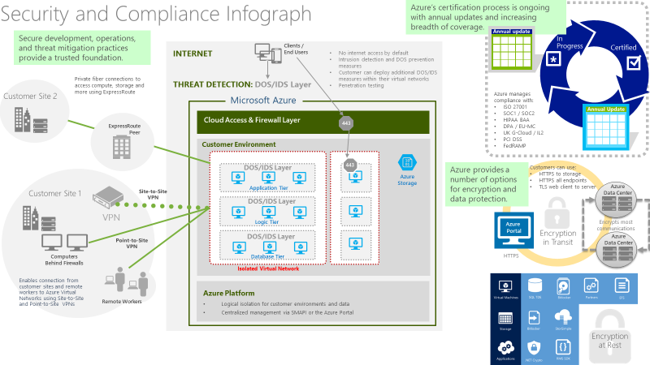

Security baseline on Azure

 Whiteboard design session trainer guide

Novemeber 2019

Information in this document, including URL and other Internet Web site references, is subject to change without notice. Unless otherwise noted, the example companies, organizations, products, domain names, e-mail addresses, logos, people, places, and events depicted herein are fictitious, and no association with any real company, organization, product, domain name, e-mail address, logo, person, place or event is intended or should be inferred. Complying with all applicable copyright laws is the responsibility of the user. Without limiting the rights under copyright, no part of this document may be reproduced, stored in or introduced into a retrieval system, or transmitted in any form or by any means (electronic, mechanical, photocopying, recording, or otherwise), or for any purpose, without the express written permission of Microsoft Corporation.

Microsoft may have patents, patent applications, trademarks, copyrights, or other intellectual property rights covering subject matter in this document. Except as expressly provided in any written license agreement from Microsoft, the furnishing of this document does not give you any license to these patents, trademarks, copyrights, or other intellectual property.

The names of manufacturers, products, or URLs are provided for informational purposes only, and Microsoft makes no representations and warranties, either expressed, implied, or statutory, regarding these manufacturers or the use of the products with any Microsoft technologies. The inclusion of a manufacturer or product does not imply endorsement of Microsoft of the manufacturer or product. Links may be provided to third-party sites. Such sites are not under the control of Microsoft and Microsoft is not responsible for the contents of any linked site or any link contained in a linked site, or any changes or updates to such sites. Microsoft is not responsible for webcasting or any other form of transmission received from any linked site. Microsoft is providing these links to you only as a convenience, and the inclusion of any link does not imply endorsement of Microsoft of the site or the products contained therein.

© 2019 Microsoft Corporation. All rights reserved.

Microsoft and the trademarks listed at <https://www.microsoft.com/en-us/legal/intellectualproperty/Trademarks/Usage/General.aspx> are trademarks of the Microsoft group of companies. All other trademarks are the property of their respective owners.

**Contents** 

<!-- TOC -->

- [Trainer information](#trainer-information)
    - [Role of the trainer](#role-of-the-trainer)
    - [Whiteboard design session flow](#whiteboard-design-session-flow)
    - [Before the whiteboard design session: How to prepare](#before-the-whiteboard-design-session-how-to-prepare)
    - [During the whiteboard design session: Tips for an effective whiteboard design session](#during-the-whiteboard-design-session-tips-for-an-effective-whiteboard-design-session)
- [Security baseline on Azure whiteboard design session student guide](#security-baseline-on-azure-whiteboard-design-session-student-guide)
    - [Abstract and learning objectives](#abstract-and-learning-objectives)
    - [Step 1: Review the customer case study](#step-1-review-the-customer-case-study)
        - [Customer situation](#customer-situation)
        - [Customer needs](#customer-needs)
        - [Customer objections](#customer-objections)
        - [Infographic for common scenarios](#infographic-for-common-scenarios)
    - [Step 2: Design a proof of concept solution](#step-2-design-a-proof-of-concept-solution)
    - [Step 3: Present the solution](#step-3-present-the-solution)
    - [Wrap-up](#wrap-up)
    - [Additional references](#additional-references)
- [Security baseline on Azure whiteboard design session trainer guide](#security-baseline-on-azure-whiteboard-design-session-trainer-guide)
    - [Step 1: Review the customer case study](#step-1-review-the-customer-case-study-1)
    - [Step 2: Design a proof of concept solution](#step-2-design-a-proof-of-concept-solution-1)
    - [Step 3: Present the solution](#step-3-present-the-solution-1)
    - [Wrap-up](#wrap-up-1)
    - [Preferred target audience](#preferred-target-audience)
    - [Preferred solution](#preferred-solution)
    - [Checklist of preferred objection handling](#checklist-of-preferred-objection-handling)
    - [Customer quote (to be read back to the attendees at the end)](#customer-quote-to-be-read-back-to-the-attendees-at-the-end)

<!-- /TOC -->

# Trainer information

Thank you for taking time to support the whiteboard design sessions as a trainer!

## Role of the trainer

An amazing trainer:

-   Creates a safe environment in which learning can take place.

-   Stimulates the participant's thinking.

-   Involves the participant in the learning process.

-   Manages the learning process (on time, on topic, and adjusting to benefit participants).

-   Ensures individual participant accountability.

-   Ties it all together for the participant.

-   Provides insight and experience to the learning process.

-   Effectively leads the whiteboard design session discussion.

-   Monitors quality and appropriateness of participant deliverables.

-   Effectively leads the feedback process.

## Whiteboard design session flow 

Each whiteboard design session uses the following flow:

**Step 1: Review the customer case study (15 minutes)**

**Outcome**

Analyze your customer's needs.

-   Customer's background, situation, needs and technical requirements

-   Current customer infrastructure and architecture

-   Potential issues, objectives and blockers

**Step 2: Design a proof of concept solution (60 minutes)**

**Outcome**

Design a solution and prepare to present the solution to the target customer audience in a 15-minute chalk-talk format.

-   Determine your target customer audience.

-   Determine customer's business needs to address your solution.

-   Design and diagram your solution.

-   Prepare to present your solution.

**Step 3: Present the solution (30 minutes)**

**Outcome**

Present solution to your customer:

-   Present solution

-   Respond to customer objections

-   Receive feedback

**Wrap-up (15 minutes)**

-   Review preferred solution

## Before the whiteboard design session: How to prepare

Before conducting your first whiteboard design session:

-   Read the Student guide (including the case study) and Trainer guide.

-   Become familiar with all key points and activities.

-   Plan the point you want to stress, which questions you want to drive, transitions, and be ready to answer questions.

-   Prior to the whiteboard design session, discuss the case study to pick up more ideas.

-   Make notes for later.

## During the whiteboard design session: Tips for an effective whiteboard design session

**Refer to the Trainer guide** to stay on track and observe the timings.

**Do not expect to memorize every detail** of the whiteboard design session.

When participants are doing activities, you can **look ahead to refresh your memory**.

-   **Adjust activity and whiteboard design session pace** as needed to allow time for presenting, feedback, and sharing.

-   **Add examples, points, and stories** from your own experience. Think about stories you can share that help you make your points clearly and effectively.

-   **Consider creating a "parking lot"** to record issues or questions raised that are outside the scope of the whiteboard design session or can be answered later. Decide how you will address these issues, so you can acknowledge them without being derailed by them.

***Have fun**! Encourage participants to have fun and share!*

**Involve your participants.** Talk and share your knowledge but always involve your participants, even while you are the one speaking.

**Ask questions** and get them to share to fully involve your group in the learning process.

**Ask first**, whenever possible. Before launching into a topic, learn your audience's opinions about it and experiences with it. Asking first enables you to assess their level of knowledge and experience, and leaves them more open to what you are presenting.

**Wait for responses**. If you ask a question such as, "What's your experience with (fill in the blank)?" then wait. Do not be afraid of a little silence. If you leap into the silence, your participants will feel you are not serious about involving them and will become passive. Give participants a chance to think, and if no one answers, patiently ask again. You will usually get a response.

#  Security baseline on Azure whiteboard design session student guide

## Abstract and learning objectives 

In this whiteboard design session, you will work with a group to design an end-to-end solution that leverages many of Microsoft Azure’s security features.

At the end of this session, you will be better able to design and recommend solutions that help organizations properly secure their cloud-based applications while protecting their sensitive data.

## Step 1: Review the customer case study 

**Outcome** 

Analyze your customer’s needs.

Timeframe: 15 minutes 

Directions: With all participants in the session, the facilitator/SME presents an overview of the customer case study along with technical tips.

1.  Meet your table participants and trainer.

2.  Read all of the directions for steps 1–3 in the student guide. 

3.  As a table team, review the following customer case study.

### Customer situation

Contoso Ltd. is a multinational corporation, headquartered in the United States that provides insurance solutions worldwide. Its products include accident and health insurance, life insurance, travel, home, and auto coverage. Contoso manages data collection services by sending mobile agents directly to the insured to gather information as part of the data collection process for claims from an insured individual. These mobile agents are based all over the world and are residents of the region in which they work. Mobile agents are managed remotely through regional corporate offices.

The fundamental workflow for Contoso is as follows:

1.  Contoso support staff process the incoming claims (which sometimes requires scrubbing) through the *corporate website*, and create a work order assigned to a mobile agent in the region of the insured.

2.  Mobile agents log in daily to the *data collection website* and retrieve the list of insured customers they are responsible for visiting. They communicate directly with the insured, schedule a time for a home visit, and ultimately during that visit collect information and input it into the data collection website. The sensitive information collected always includes Personally Identifiable Information (PII) and may include Protected Health Information (PHI) about the insured customer. This data is sent over the public Internet securely over TLS (SSL).

3.  When the data collection for an insured is completed, the mobile agent marks the task completed so that the corporate system can process those results.

4.  Support staff processes complete work orders and submits results through the corporate website requiring another transfer of sensitive data. They also tend to utilize Microsoft Support when tough issues arise and want to know what options they have to engage and log support activities with VMs and other Azure resources. 

Contoso currently hosts their systems at co-locations facilities within each geopolitical region and manages all IT operations for the systems. In the United States, they have achieved SOC 1 and SOC 2 compliance and follow required HIPAA regulations to protect PHI. Because of the new European GDPR laws, Contoso must evaluate their computing environments for compliance gaps. Contoso has concerns about maintaining their SOC 2 certification and HIPAA compliance with respect to moving to Azure. They would like to specifically address concerns about regional issues of data sovereignty for sensitive data within the context of the GDPR and want to ensure that if they move to Azure, they will be able to continue to have isolation between components.

In addition to the GDPR compliance requirements, they are expecting significant growth within the United States and abroad. They foresee the need to scale their system and are exploring moving their web applications (corporate and data collection web apps) to Microsoft Azure via lift and shift and other applicable methods to simplify some of the operations management overhead and associated costs, beginning with their U.S. data center and then those in Europe. They would also like to ensure that the corporate website and external facing web apps are sufficiently isolated.  Lastly, they want to ensure that resources are created using best practices and that those practices are followed during the resource provisioning process.

Contoso has been using their on-premises SIEM to do most of their auditing and log reporting. They are wondering what options they have to monitor their on-premises and future cloud-based resources.  They have thoughtfully tuned their on-premises SIEM to reduce false positives and normalize the metadata across different log types. They are worried about the amount of logs and potential for unnecessary work when they move workloads to Azure.

Jack Tradewinds, the CIO of Contoso Ltd, has heard a great deal of positive news about Azure and its progress in terms of security and compliance. He would like to learn more about the security features and if they can move some of their data and applications away from their on-premises datacenter. Given his long-standing relationship with Microsoft, he would like to see if Azure can meet his needs.

### Customer needs 

1.  Assure data privacy and protection across all aspects of the system; in transit and at rest.

2.  Address issues of data sovereignty with respect to the location of sensitive data.

3.  Ability to scale as the company grows and system load increases.

4.  Contain hosting and operational costs associated with running the system.

5.  Enable method to continually review and assign legal compliance tasks to the appropriate individuals and provide a compliance reporting ability for Azure resources.  

6.  Enforce subscription owners to configure Azure resources with compliance and security while disallowing the creation of specific resources.

7.  Limit access to the corporate site to users on the Contoso domain, and continue to support VPN access.

8.  Extract all web applications that have configuration or embedded connection strings to a more secure implementation.

9.  Migrate current database applications to Azure PaaS solution with the appropriate data backup features implemented to prevent catastrophic data loss due to intentional or unintentional acts.

10.  Implement all security best practices on the migrated databases such as encryption at rest and during transport as well as ensure that sensitive data is not exposed to non-admin database users and applications.

11. Ensure network segregation between Azure admin and the lift and shifted web and database tiers.

12. Enable logging across all components (identity, virtual network, virtual machine, web, and database) to support an all-encompassing monitoring solution.

13. Ensure that Azure admins utilize best practices when accessing the Azure virtual machine resources and that all logins are logged for identity theft analysis activities.

14. Ensure ease of use by syncing appropriate admin username and passwords for on-premises and cloud resources.

15. Ensure that only authorized users can access specific Azure resources when logged into the Azure Portal.

16. Setup auditing such that software installs are monitored across Azure virtual machine resources.

17. When specific security events are detected (such as a port scan), allow for the execution of actions to remediate, start the investigative process or prevent further information leakage or damage.

### Customer objections 

1.  Can Azure support the lift and shift of their web and database applications?

2.  Admins are worried that they won't have the bandwidth to perform deployments of the corporate website and other supporting web applications.

3.  Can Azure help contain costs for minimally used costly production and development resources?

4.  Does Azure support the ability to allow VPN connections to specific resources?

5.  Can Microsoft employees or government entities access our data?

6.  How does Azure protect against threats?

7.  Does Azure allow enough granular RBAC controls to meet our least privilege needs?

8.  Is Azure virtual networking flexible enough to meet our requirements?

9.  Can Azure supplement on-premises and 3^rd^ party SIEM systems for auditing and compliance tasks?

10. What certifications does Azure have and can Azure hosted applications meet the US and European compliance goals?

11. Is Azure flexible enough to support data sovereignty needs and issues like those referenced in GDPR articles?

12. How can we ensure continued SOC 1 and SOC 2 compliance?

13. Does Azure permit penetration testing as a part of a security assessment?

### Infographic for common scenarios

This Infographic shows an example of a generic implementation of various security Azure technologies in action that can be used as a reference in your design:

## Step 2: Design a proof of concept solution

**Outcome** 

Design a solution and prepare to present the solution to the target customer audience in a 15-minute chalk-talk format. 

Timeframe: 60 minutes

**Business needs**

Directions: With all participants at your table, answer the following questions and list the answers on a flip chart:

1.  Who should you present this solution to? Who is your target customer audience? Who are the decision makers? 

2.  What customer business needs do you need to address with your solution?

**Design**

Directions: With all participants at your table, respond to the following questions on a flip chart:

*High-level architecture*

Briefly sketch-out and propose a high-level solution that meets the customer's business and technical needs and mitigates their objections. For this workshop, you may choose from the following technologies (you may not need all of them in the correct solution):

1.  Azure Virtual Machines and Networks, Network Security Groups

1.  Virtual Private Networks (Point to Point, Site to Site) and Express Route

1.  Azure Web Apps

1.  Azure Firewall

1.  Azure Front Door

1.  Azure SQL DB Security Features (Threat Detection, TDE, Column Level Encryption, Service Endpoints, etc.)

1.  Azure Storage Encryption

1.  SQL Server in a Virtual Machine

1.  Azure Security Center, Azure Monitor and Log Analytics

1.  Azure Sentinel and Azure Policy

1.  Azure Key Vault

1.  Microsoft Azure Active Directory (Connect, IAM, etc.)

1. Microsoft Intune

*Securing Sensitive Data*

On your diagram, indicate how you would secure any sensitive data at rest and in transit with respect to the following:

1.  Web Tier (corporate vs. data collection)

2.  Database Tier

3.  Network, Internal, and External Communications

*Ensuring auditing and compliance*

Describe how you will use Azure features to ensure the following:

1.  How will you monitor and audit VM access?

2.  How will you monitor and audit network traffic across Virtual Networks?

3.  How will you monitor and audit Azure SQL?

4.  Create custom alerts and execute remediation and investigation activities on detection?

5.  What tools would you setup surface audit and compliance reporting to IT Executives?

*Ensuring availability and business continuity*

Describe how you would ensure that the following resources would be available in the unlikely event of an attack or intentional or unintentional data loss?

1.  Virtual Machines

2.  Azure SQL

*Ensuring protection*

Describe how you would secure each Azure resource from internal and external attacks.

1.  Ensure that admin credentials are sufficiently protected and monitored.

2.  Prevent admins from causing intended and unintended harm to the environment such as unapproved software installs.

3.  Admins access Azure resources from secured and/or compliant corporate assets and do not directly access any production Virtual Machines from the internet.

4.  Prevent Denial of Service (DoS) and common web application attack vectors from reaching the web applications

**Prepare**

Directions: With all participants at your table: 

1.  Identify any customer needs that are not addressed with the proposed solution.

2.  Identify the benefits of your solution.

3.  Determine how you will respond to the customer’s objections.

Prepare a 15-minute chalk-talk style presentation to the customer. 

## Step 3: Present the solution

**Outcome**
 
Present a solution to the target customer audience in a 15-minute chalk-talk format.

Timeframe: 30 minutes

**Presentation** 

Directions:

1.  Pair with another table.

2.  One table is the Microsoft team and the other table is the customer.

3.  The Microsoft team presents their proposed solution to the customer.

4.  The customer makes one of the objections from the list of objections.

5.  The Microsoft team responds to the objection.

6.  The customer team gives feedback to the Microsoft team.

7.  Tables switch roles and repeat Steps 2–6.

## Wrap-up 

Timeframe: 15 minutes

Directions: Tables reconvene with the larger group to hear the facilitator/SME share the preferred solution for the case study.

## Additional References

|    |            |
|----------|:-------------:|
| **Description** | **Links** |
| Azure Virtual Machines | <https://docs.microsoft.com/en-us/azure/virtual-machines/windows/>   |
| Azure Virtual Networks | <https://docs.microsoft.com/en-us/azure/virtual-network/virtual-networks-overview>   |
| Azure DDoS | <https://docs.microsoft.com/en-us/azure/virtual-network/ddos-protection-overview>   |
| Network Security Groups | <https://docs.microsoft.com/en-us/azure/virtual-network/virtual-networks-nsg>  |
| Azure VPN Gateway   |  <https://docs.microsoft.com/en-us/azure/vpn-gateway/vpn-gateway-howto-site-to-site-resource-manager-portal>  |
| Azure Firewall   |  <https://docs.microsoft.com/en-us/azure/firewall>  |
| Azure Front Door   |  <https://docs.microsoft.com/en-us/azure/frontdoor/front-door-overview>  |
| Azure Application Gateway   |  <https://docs.microsoft.com/en-us/azure/application-gateway>  |
| Azure Web Apps   | <https://docs.microsoft.com/en-us/azure/app-service/>   |
| Azure SQL   | <https://docs.microsoft.com/en-us/azure/sql-database/>     |
| Azure SQL documentation, TDE, data masking and encryption at rest   |  <https://docs.microsoft.com/en-us/azure/sql-database/sql-database-always-encrypted-azure-key-vault>   |
| Express Route   | <https://docs.microsoft.com/en-us/azure/expressroute/expressroute-introduction>  |
| Azure Storage Encryption  | <https://docs.microsoft.com/en-us/azure/storage/common/storage-service-encryption>  |
| SQL Server (IaaS)   | <https://docs.microsoft.com/en-us/azure/virtual-machines/windows/sql/virtual-machines-windows-sql-server-iaas-overview>  |
| Azure Identity Access Management (IAM)  | <https://docs.microsoft.com/en-us/azure/active-directory/role-based-access-control-configure>  |
| Azure Monitor and Log Analytics   | <https://docs.microsoft.com/en-us/azure/monitoring-and-diagnostics/monitoring-overview>   |
| Azure Sentinel   | <https://docs.microsoft.com/en-us/azure/sentinel/>   |
| Azure Policy   | <https://azure.microsoft.com/en-us/services/azure-policy/>   |
| Azure Lockbox   | <https://azure.microsoft.com/en-us/blog/approve-audit-support-access-requests-to-vms-using-customer-lockbox-for-azure/>   |
| Azure Key Vault   |  <https://docs.microsoft.com/en-us/azure/key-vault/>  |
| Microsoft Azure Active Directory Connect  | <https://docs.microsoft.com/en-us/azure/active-directory/connect/active-directory-aadconnectsync-whatis>  |
| Lift and Shift (IaaS)  |  <https://docs.microsoft.com/en-us/dotnet/standard/modernize-with-azure-and-containers/lift-and-shift-existing-apps-azure-iaas> |
| Microsoft Intune  | <https://docs.microsoft.com/en-us/intune>   |
| Conditional Access  | <https://docs.microsoft.com/en-us/azure/active-directory/active-directory-conditional-access-azure-portal>    |
| Azure, Office 365, Azure SQL and Cloud App references   | <https://docs.microsoft.com/en-us/azure/active-directory/active-directory-conditional-access-no-modern-authentication>  |
| SQL Database Conditional Access  | <https://docs.microsoft.com/en-us/azure/sql-database/sql-database-conditional-access>  |
| SQL Database Service Endpoints  | <https://docs.microsoft.com/en-us/azure/sql-database/sql-database-vnet-service-endpoint-rule-overview>  |
| Azure AD Conditional Access Technical Reference  | <https://docs.microsoft.com/en-us/azure/active-directory/active-directory-conditional-access-technical-reference>   |
| Advanced Threat Analytics  | <https://docs.microsoft.com/en-us/advanced-threat-analytics>   |
| Microsoft Cloud App Security  | <https://docs.microsoft.com/en-us/cloud-app-security>   |
| Compliance Commitments   |  <http://azure.microsoft.com/en-us/support/trust-center/services/>  |
| Azure Trust Center  | <http://azure.microsoft.com/en-us/support/trust-center/>     |

# Security baseline on Azure whiteboard design session trainer guide

## Step 1: Review the customer case study

-   Check in with your table participants to introduce yourself as the trainer.

-   Ask, "What questions do you have about the customer case study?"

-   Briefly review the steps and timeframes of the whiteboard design session.

-   Ready, set, go! Let the table participants begin.

## Step 2: Design a proof of concept solution

-   Check in with your tables to ensure that they are transitioning from step to step on time.

-   Provide some feedback on their responses to the business needs and design.

    -   Try asking questions first that will lead the participants to discover the answers on their own.

-   Provide feedback for their responses to the customer's objections.

    -   Try asking questions first that will lead the participants to discover the answers on their own.

## Step 3: Present the solution

-   Determine which table will be paired with your table before Step 3 begins.

-   For the first round, assign one table as the presenting team and the other table as the customer.

-   Have the presenting team present their solution to the customer team.

    -   Have the customer team provide one objection for the presenting team to respond to.

    -   The presentation, objections, and feedback should take no longer than 15 minutes.

    -   If needed, the trainer may also provide feedback.

## Wrap-up

-   Have the table participants reconvene with the larger session group to hear the facilitator/SME share the following preferred solution.

## Preferred target audience

Jack Tradewinds, CIO of Contoso Insurance

The primary audience is made up of the business decision makers and technology decision makers. From the case study scenario, this would include the CEO, CTO and CIO and CLO (Chief Legal Officer).

## Preferred solution

*High-level architecture*

Without getting into the details (the following sections will address the details), diagram your initial vision for handling the top-level requirements.

1.  Network:

    

2.  Auditing and compliance:

    

*Securing sensitive data*

On your diagram, indicate how you would secure any sensitive data at rest and in transit with respect to the following:

1.  Web Tier

    a.  The topology deploys independent Azure VMs for their corporate website and their external data collection website. Alternately, an Azure Web App could be used to host the data collection web site, but not the corporate website (because Azure Web Apps does not offer any configuration that provides private, virtual network only endpoints---at least until App Service Environments leave preview). Cloud Services were ruled out so that Contoso could avoid changes to their development and deployment experience, making the migration more direct via a lift and shift effort.

    b.  Access to the corporate website is restricted to within the virtual network, as no public endpoint is exposed. Access to the public website is possible, as a public endpoint listening for TLS connection on port 443 is exposed via the Azure load balancer, and similarly, the VM itself has a firewall rule allowing TCP connections on port 443. TLS needs to be properly configured, with the appropriate certificates installed and setup with IIS on each VM.

    c.  The connection strings used by the Web Apps to access the database should be removed and replaced with calls to Azure Key Vault.

2.  Database Tier

    a.  SQL Azure was setup, and the on-premises database was migrated to it.

    b.  SQL Transparent Data Encryption (TDE) was enabled to provide additional security to sensitive data at rest.

    c.  For highly sensitive fields, Column Level Encryption (CLE) was enabled using Azure Key Vault to protect fields having sensitive data from users who have the ability to view the contents of the table but have no need to read the sensitive data.

    d.  For other reporting users, data masking was implemented to allow partial viewing of sensitive data.

    e.  The SQL Azure server\'s virtual network was configured only to allow SQL traffic from the web and reporting applications with logging enabled.

3.  Network, Internal and External Communications

    a.  With the websites hosted in Azure VM\'s, the Azure VMs are joined to an isolated virtual network with VPN access enabled from the corporate site (via Site-to-Site configuration).

    b.  The application tiers are separated by virtual networks and subnets\-- the website VM\'s are placed within a \"front-end\" subnet within the Virtual Network, and the SQL Database VMs are placed in a \"back-end\" subnet. This separation helps to create a security boundary that can be leveraged by firewalls and intrusion detection systems to more easily detect suspicious traffic, and to quickly quarantine traffic from the websites front-end to the back-end database should a breach be detected.

    c.  In the case where the data collection website is hosted in Azure, the Virtual Network must be enabled for point-to-site connectivity, which requires the creation of an address space to be used in assigning IP addresses to member Web Apps as well as a Gateway. By doing so, a similar isolation to that provided by the \"front-end\" VM subnet is enabled.

    d.  The Azure virtual network uses industry-standard IPSEC protocol to secure all communications between the corporate VPN gateway and Azure. Additionally, communication with both should occur using TLS.

*Ensuring auditing and compliance*

Describe how you will use Azure features to ensure the following:

1.  How will you monitor and audit VM Access?

    a.  Azure Security Center can be used to implement Just in Time (JIT) virtual machine access. You can also lock down VM modification using Azure IAM settings using specific users or groups with specific Azure roles assigned.

    b.  Ensure that admins are included in the appropriate resource administrative groups with appropriate IAM roles assigned and using Privileged Identity Management (PIM).

2.  How will you monitor and audit network traffic across Virtual networks?

    a.  Azure Security Center can be used to create custom alerts based on logging data from the Network Security Group rule execution.

    b.  You can use Azure Monitor to do network testing and packet capture across virtual machines and virtual networks.

    c.  Azure Monitor and Log Analytics can be leveraged to create queries across Azure event logging event data that will feed into Power BI reports.

    d.  Azure Sentinel can be used to create alerts and cases for auto-assignment and investigation activities

3.  How will you monitor and audit Azure SQL?

    a.  Auditing and Threat detection was enabled on all SQL Azure databases.

    b.  Azure Diagnostics was enabled, and all logs are being forwarded to Log Analytics and Azure Sentinel

4.  Create custom alerts and execute remediation and investigation activities on detection?

    a.  Azure Sentinel can be used to hunt down specific events and create alerts based on event data
    
    b.  Azure Runbooks can be setup to execute on alerts.

5.  What tools would you setup to surface audit and for compliance reporting to IT Executives?

    a.  Azure Policy can be used to determine if resource group owners have been following best practice organizational policies

    b.  Compliance Manager can be used to implement compliance activities and task assignments as it related to legislative requirements

    c.  Secure score can also be used to determine what activities can be performed to further secure the Azure subscription and its resources

*Ensuring availability and business continuity*

Describe how you would ensure that the following resources would be available in the unlikely event of an attack or intentional or unintentional data loss?

1.  Virtual Machines

    a.  Azure Recovery Service Vault **configured to use GRS** was utilized to make backups of virtual machines

2.  Azure SQL

    a.  Azure Recovery Service Vault was utilized to make hourly log backups of SQL Azure.

    b.  Azure SQL geo-replication was enabled to ensure high availability and redundancy.

*Ensuring protection*

Describe how you would secure each Azure resource from internal and external attacks.

1.  Ensure that admin credentials are sufficiently protected and monitored?

    a.  Azure Premium features should be enabled to configure admin credentials to have Multi-factor Authentication.

    b.  Azure AD Identity protection features should be enabled to ensure that if a credential is or attempting to be compromised that the information is available for alerting and reporting, that includes logons, failed logins, locked accounts, active critical issues, etc.

2.  Prevent admins from causing intended and unintended harm to the environment such as unapproved software installs.

    a.   Adaptive application controls can be enabled on all virtual machines to ensure that no software is being installed that has not been approved.

    b.  Through Security Center, implement the Auto Provisioning of the Microsoft Monitoring Agent (MMA) extension on all existing and newly created VMs for data collection activities.

3.  Admins access Azure resources from secured and/or compliant corporate assets and do not directly access any production Virtual Machines from the internet.

    a.  Privileged Access Workstation (PAW) virtual machine(s) will be set up as the entry point to gain access to all other virtual machines in the Azure subscription. No Access to virtual machines other than the PAW will be remote desktop enabled.

    b.  Microsoft Intune can be used to ensure that only corporate and/or compliant devices can access Azure and Azure resources via conditional access policies.

    c.  Additionally, the VM's in the web app and data tiers can leverage the Microsoft Antimalware extension, or partner security extensions (currently from Symantec and Trend Micro) that include antivirus, antimalware, firewalls and intrusion detection systems.

    d.  All other measures Contoso has already put in place to secure PHI will continue to exist when the solution is deployed to Azure.

4.  Prevent Denial of Service (DoS) and common web application attack vectors from reaching the web applications

    a.  You can place the Azure Firewall and or Azure Front Door in front of your web applications to implemention OWASP rules and prevent bad requests from reaching your back end web applications.

## Checklist of preferred objection handling

1.  Can Azure support the lift and shift of their web and database applications?

    Yes, and it is the next logical step for many organizations in their cloud journey: 

    ![An arrow labeled Existing .NET application modernization: Maturity models spans four boxes labeled Existing apps (On-premises), Cloud Infrastructure-Ready (Azure), Cloud DevOps-Ready (Azure), and Cloud-Optimized (Azure). The Cloud Infrastructure-Ready box is highlighted in yellow. Below the Cloud Infrastructure-Ready and Cloud DevOps-Ready boxes is an arrow labeled LIFT and SHIFT: No re-architect, no coded changes. Below the Cloud-Optimized box is an arrow labeled Architect for the cloud (might need new code).](images/Whiteboarddesignsessiontrainerguide-Azuresecurityprivacyandcomplianceimages/media/image5.png "Existing .NET application modernization: Maturity models ")

    There are many programs that customers can take advantage of to help with the move Azure including:

    -   [Microsoft FastTrack for Azure](https://azure.microsoft.com/en-us/roadmap/fasttrack-for-azure/)

    -   [Azure Migrate](https://azure.microsoft.com/en-us/blog/announcing-azure-migrate/)

2.  Admins are worried that they won't have the bandwidth to perform deployments of the corporate website and other supporting web applications.

    Azure ExpressRoute can be used to create private connections between Azure datacenters and infrastructure on your premises or in a colocation environment. ExpressRoute connections don\'t go over the public Internet, and they offer more reliability, faster speeds, and lower latencies than typical Internet connections. In some cases, using ExpressRoute connections to transfer data between on-premises systems and Azure can give you significant cost benefits.

3.  Can Azure help contain costs for minimally used costly production and development resources?

    Yes, Azure Cost Management + Billing has free features that allows you to monitor your cloud spend, drive organizational accountability and optimize your cloud efficiency.

4.  Does Azure support the ability to allow VPN connections to specific resources?

    Yes, Azure provides the ability to do site-to-site IPSec VPNs and the ability to create point-to-site VPNs. By utilizing a site-to-site VPN Gateway, you can connect your on-premises networks with Azure utilizing IPSec and IKE. Point-to-site will allow individual client computers to connect to your Azure virtual network(s) via SSTP or IKE.

5.  Can Microsoft employees or government entities access our data?

    Access to customer data by Microsoft operations and support personnel is denied by default. When granted, access is carefully managed and logged. Data center access to the systems that store customer data is strictly controlled via lock box processes.

    Microsoft does not share data with third parties unless permitted by the customer.

    Microsoft provides only the data it is legally compelled to provide, but never voluntarily.

    Both employees and subcontractors work at Microsoft data centers.

    We require subcontractors to join Microsoft\'s Vendor Privacy Assurance Program, to meet our privacy requirements by contract, and to undergo regular privacy training. We contractually obligate subcontractors that work in facilities or on equipment controlled by Microsoft to follow our privacy standards. All other subcontractors are contractually obligated to follow privacy standards equivalent to our own.

    Azure Support can access your VMs utilizing the audited Azure Lockbox feature when needed in the resolution of difficult issues.

6.  How does Azure protect against threats?

    Intrusion detection and prevention systems, denial of service attack prevention, regular penetration testing, and forensic tools help identify and mitigate threats from both outside and inside of Azure.

    Microsoft Antimalware is built-in to Cloud Services and can be enabled for Virtual Machines to help identify and remove viruses, spyware and other malicious software and provide real-time protection. Customers can also run antimalware solutions from partners on their Virtual Machines.

    Microsoft has decades of operating system security experience running its applications and services and latest developments allow the Microsoft Security Graph to analyze events to determine if and when an attack is occurring.

    Azure Firewall can provide DDoS and Threat Intelligence services to ensure bad actors are not being allowed access to the web applications.

    If the customer has a healthy security budget, they could migrate their web applications to Application Service Environments (ASE) with Web Application Gateway (WAG) to implement an even more segregated and secured environment.

7.  Does Azure allow enough granular RBAC controls to meet our least privileged needs?

    Azure resource groups can be set up with users, groups, and applications with varying levels of role assignments to meet any customer requirements.

    Azure comes with several pre-built built-in roles - <https://docs.microsoft.com/en-us/azure/active-directory/role-based-access-built-in-roles> and allows you to create custom roles - <https://docs.microsoft.com/en-us/azure/active-directory/role-based-access-control-custom-roles>

    Additionally, you can assign individual users and groups to just about any Azure resource.

8.  Is Azure virtual networking flexible enough to meet our requirements?

    Azure Virtual Network gives you an isolated and highly-secure environment to run your virtual machines and applications. Use your private IP addresses and define subnets, access control policies, and more. Use Virtual Network to treat Azure the same as you would your own datacenter.

    Traffic between Azure resources in a single region, or in multiple regions, stays in the Azure network---intra-Azure traffic doesn't flow over the Internet. In Azure, traffic for virtual machine-to-virtual machine, storage, and SQL communication only traverses the Azure network, regardless of the source and destination Azure region. Inter-region virtual network-to-virtual network traffic also flows entirely across the Azure network.

    In a virtual network, run your favorite network virtual appliances such as WAN optimizers, load balancers, and application firewalls and define traffic flows, allowing you to design your network with a greater degree of control.

    Use Virtual Network to build your hybrid cloud applications that securely connect to your on-premises datacenter---so an Azure web application can access an on-premises SQL Server database, or authenticate customers against an on-premises Azure Active Directory service.

9.  Can Azure supplement on-premises and 3rd party SIEM systems for auditing and compliance tasks?

    Yes, Azure has a robust set of integration scenarios for customers including:

    -   Command Line Interface (CLI), PowerShell and a [REST API](https://docs.microsoft.com/en-us/azure/monitoring-and-diagnostics/monitoring-rest-api-walkthrough)

    -   Email and webhooks based on triggers

    -   Events streamed to Event Hub

    -   Power BI integration

    -   Events saved to a Storage Account for analysis later

    -   Export data using Log Profiles with Log Analytics

    Ultimately, you will want to encourage them to use the new Azure Sentinel offering (currently in preview as of 4/2019).

10.  What certifications does Azure have and can Azure hosted applications meet the US and European compliance goals?

-   Certifications

    -   U.S. Specific Certifications

        -   Cloud Security Alliance CCM

        -   HIPAA BAA

        -   FedRAMP

        -   FISMA

        -   FBI CJIS

        -   FERPA

        -   FIPS 140-2

        -   FDA 21 CFR Part 11

    -   International Certifications

        -   PCI DSS Level 1

        -   ISO 27001 / 27002

        -   SOC 1 / SSAE 16 / ISAE 3402 and SOC 2

        -   EU Model Clauses

        -   United Kingdom G-Cloud / IL2

        -   Australian Government IRAP

        -   Singapore MTCS Standard

        -   China Cloud Computing and Policy Forum (CCCPPF)

        -   MLPS (China)

    Azure hosted applications can meet compliance goals is designed and maintained properly.

11.  Is Azure flexible enough to support data sovereignty needs and issues like those referenced in GDPR articles?

     Microsoft was among the first cloud providers to sign a set of EU "model clauses," which are standard contractual clauses that govern the international transfer of personal data. When included in service agreements with data processors, the model clauses assure customers that appropriate steps have been taken to help safeguard personal data, even if data is stored in a cloud-based service center located outside the EEA. In affirming these, a data processor is affirming that they are meeting the data protection standards set forth by the EU Directive on Data Protection.

     Microsoft has UK Government IL2 certification. UK Government Departments require products and services to be accredited to IL2 or IL3. These terms, Business Impact Levels 2 or 3, essentially require the telecoms operator or service provider to pass an audit based on ISO 27k as additionally extended by the *NGN Good Practice Guide*.

12.  How can we ensure continued SOC 1 and SOC 2 compliance?

     To maintain SOC 1 and SOC 2 compliance, there are auditing requirements for the customer. To address this need, Microsoft makes certificates and audit reports available in support of the customer\'s reports and certifications.

     -   ISO/IEC 27001:2005 Audit and Certification certificates are publicly available.

     -   SOC 1 and SOC 2 reports are available under NDA to customers to meet auditing requirements.

     Customers cannot audit the data center. However independent audits and certifications are shared instead of individual customer audits. These certifications and attestations accurately represent how Microsoft obtains and meets security and compliance objectives, and serve as a practical mechanism to validate Microsoft promises for all customers.?? Allowing potentially thousands of customers to audit Microsoft services would not be a scalable practice and might compromise security and privacy.?? The independent third-party validation program includes audits that are conducted on an annual basis to verify Azure security controls.

13.  Does Azure permit penetration testing as a part of a security assessment?

     Yes, and as of mid-2017, you no longer need to get approval to execute these tests, but you can still notify Microsoft if you are planning to do so.

## Customer quote (to be read back to the attendees at the end)

"We are moving into the secure digital world with Azure, helping our agents ensure the security and protection of client personal information and protecting them from the unpredictable and unforeseen events of life."

Jack Tradewinds, CIO of Contoso Insurance Ltd.

